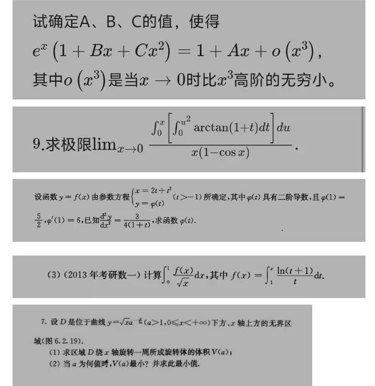
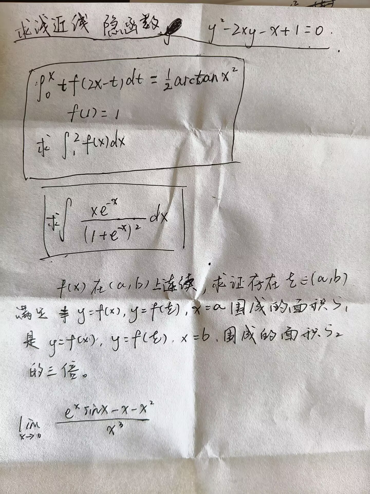

# 面向希望转入计算机相关专业学生的南昌大学转专业攻略

## 写在前面：

> 本经验帖写于2025年6月17日，我马上要搬东西去计科了。我大一上绩点3.3，惊险通过了考核，第一志愿计科，第二志愿软工，劳动节过完，当时结果出来，我的两个志愿都是拟录取状态。
>
> 对希望转入计算机相关专业的学弟学妹们：
>
> 我希望你在转专业报名前就看到这个贴子，因为信息差真的很多。
>
> 当然，如果你在转专业报名后刷到，也没有关系，我会在后文无偿提供备考参考资料和面试准备，看完你肯定不会吃亏。
>
> 本文不讨论信工学院的计算机相关专业，不讨论大一初的实验班选拔，因为我并不了解情况，不能提供很好的策略，请另寻高明。

首先你要争取大一上没有挂科。

转专业考试时间与大一下的期中考试时间段接近，在此前一个月注意班委文件或者转发消息，最后会在 **微信 服务号 南昌大学教务处 教务系统** 进行报名，报名时间有限定，切记不要错过了()

**若想转计算机，必须把“计算机”填在第一志愿。只有在“第一志愿"招不满的基础上，才会考虑招“第二志愿“的同学。【这个潜规则 是 多少学长学姐的辛酸泪。每年都有笔试满分，但是没进面试的人。究其根本就是“计算机几乎只招第一志愿”。】(没经历过的是不会知道此信息的，经历过如果不是真心为你好也是不会公开告诉你的)**

25年情况也是这样，建议冲数计学院的，第一志愿计科大数据二选一，第二个选一个保底，**别把这两个专业一起选**，会浪费一个名额

对于想报名软院的同学，24年和25 年，软院没有第二志愿歧视，大概可放心。**（请根据你那年的文件判断，软院有没有明确声明，不区分第一第二志愿）**

> ##### 南昌大学微信教务处-转专业申请的界面
>
> - 显示”转出审核中“，是指”你的原学院的辅导员“需要对你们转出申请，进行同意。(奖惩情况，转专业理由随便填，没人会看的)(辅导员一般都会同意的，这点 ncu 还是很人性化的)
> - 后面会显示”考核中“，这个会一直持续道五一假期结束(同时，这个阶段会显示转专业的学院 QQ群)
> - 五一假期结束后，就会显示”拟录取“/”未通过考核“/“递补第x名”。
> - 正式的转专业名单会在6月初公布，但五一假期之后就会出结果，这段时间是给你们“有些人录取了又不想去了”“递补”等等用的。所以，现在就不要先想“两个专业都录取了该怎么”之类的问题。专门后面会有一个月给你们处理这些问题的。

## 志愿策略推荐

- **低绩点，高数强，比较需要转专业**：一志愿大数据/信工竞争弱一点的专业，二志愿软院二选一
- **高绩点，高数扎实**：一志愿计科/大数据/信工强专业，二志愿信工竞争弱一点的专业
- 没有那么能折腾，希望绝境求生，**强烈需要转专业**：一志愿软工，二志愿网安

### 为什么

- 数计计算机两个专业基本第一志愿 Only，想进数计的，第一志愿只能填你最想去的那个
- 信工只有笔试，综合看绩点+高数+英语，由于是笔试决定一切，所以好像没有区分第一第二志愿，只考试的选拔对不希望折腾面试、考试型选手的比较友好
- 青山湖校区的软院由于特殊原因，很多人不愿意去，可以提前了解软院的环境和学费。那咋了，如果你是一战，我建议你去考软院，拿下 top2 人这一辈子就满足了。大雪深埋本科垃圾专业！（开玩笑的，考研圣经，而且我们学校基本只有大一下这一次转专业机会，要么就是实验班的特殊照顾，比如优补进入实验班完成转专业）

## 计科 & 大数据

### 考试流程

1. 高数笔试考试形式：
   参考数学与计算机学院23级24级转专业考试考场安排表
   考试时间:中午12:30-13:30
   地点:详见考试安排表
   考试科目:高等数学
   考试要求:学生凭身份证和校园卡进入考场，两证缺一不可
   注意:考试时，将自己对应的序号写在试卷右上角
2. 面试：
   一个英文面试（自我介绍，之后老师对你进行小小的英文提问），一个专业课面试（开盲盒抽一个专业课问题，然后对此进行相关的回答），这我建议等你确定自己进入面试后再准备
2. 转计算机-高数难度：
   从去年考试题目可见，考试都是考研数学的真题。
   所以有余力者，可以适当做做真题。
   前些年听说会考高数下的内容，但结果数计没有考，软院考了。追求”稳定性的同学，可以学下高数下。
   (但是是考了微分方程！有些专业大一上高数没有学微分方程的需要留意一下)
4. 综合总分由第一学期平均学分绩点(按百分制换算)、《高等数学》及综合面试构成，按照30%、30%、40%的比例计算总分。根据总分，第一志愿择优录取，并按录取计划10%的人数作为递补。

### 2024级数计计算机专业转专业数据分析报告

#### 一、总体申请情况分析

1. **申请人数规模**：
   - 2024级申请转入计算机科学与技术专业的学生141人（名额19人，按文件百分比算可得，面试进23人）
   - 申请数据科学与大数据技术专业的学生14人（名额5人，面试进6人）
2. **生源构成特点**：
   - 主要来自理工科专业（占85%以上），包括：
     - 工程建设学院（土木、水利等）
     - 生命科学学院（生物科学、生态学等）
     - 化学化工学院
     - 物理与材料学院
   - 约15%来自医学部、经济管理、公共政策等非传统理工科院系
   - 有少量文科专业学生申请

#### 二、笔试筛选情况（注意：这里是计科专业情况，大数据人太少了不好分析）

1. **面试名单规模**：
   - 进入计算机科学与技术专业面试的学生共23人
   - 与拟接收人数19人的比例约为1.2:1，符合官方公布的筛选比例
2. **计科录取生源背景分析**：
   - **专业分布**：
     - 生命科学学院：6人（生物科学、生态学等）
     - 医学部：5人（预防医学、药学等）
     - 工程建设学院：3人（土木工程等）
     - 化学化工学院：3人
     - 其他学院：6人（含经济管理、公共政策等）
   - **性别比例**：
     - 男生：16人（约70%）
     - 女生：7人（约30%）
3. **志愿填报特征**：
   - 所有进入面试的学生均将计算机专业作为第一志愿
   - 验证了"计算机专业几乎只招第一志愿"的潜规则

#### 三、竞争态势分析

**录取比例**：

- 计算机科学与技术：面试7进1
- 数据科学与大数据技术：面试3进1

#### 四、一些发现

1. **跨专业成功案例**：
   - 医学部预防医学专业有3人进入计科面试
   - 公共政策管理学院人力资源管理专业有1人进入
   - 证明非理工科背景学生通过充分准备也能通过笔试
3.  **计科转入者很多人学习的专业，高数都不是理工类高数**：
   - 理工类高数强者很多去信工先进了
   - 医学类高数 财经类高数 这些高数类的高数上考试会更友好，所以他们的高数分数会很高，导致他们只要没有放弃专业课（我觉得这里才是困难的地方），绩点不会差，在强者都去了先进制造和信工院的情况下，计科会稍微友好一点
   - 对于理工类高数同学，建议充分准备，计算机专业的考试只有五题，把握住机会就好赢，你们至少是课程内的学习，其他高数类的竞争者还需要自学你们的教材

#### 五、数据印证的政策要点

1. 验证了"计算机专业优先录取第一志愿"的潜规则
3. 非理工科专业学生确有成功转入案例

#### 六、建议

对申请者：

- 第一志愿慎重，热门专业基本就只看第一志愿收了，第二志愿选一个不歧视的专业
- 确保大一绩点保持在专业前20%更稳妥（建议至少3.0以上，不然有点浪费机会，我推荐低绩点但是一定想转的人想冲就大数据，一定需要有保底，推荐软工网安）
- 重视高数上，一定要准备充分，临近考试阶段一定别摆烂，本人3.3低绩点都是考前5天 all in 高数 临门一脚冲进计科的，相信你一定更厉害

## 软工 & 网安

### 官方文件：软件学院2024级本科学生转专业实施细则

根据《南昌大学本科学生转专业（类）实施办法（2020年修订）》(南大教函〔2020〕5号)及《关于做好2024级本科生转专业（类）工作人通知》（南大教函〔2025〕38号）等文件精神，结合学院教学资源条件，制定2024级本科学生转专业实施细则如下：
**转专业工作的指导思想**
以学生为本，公平、公正、公开。本着学生自愿和学院考核相结合的方式择优录取。
**申请转入学院的学生应符合以下基本条件**
1、2024级本科在校已注册、缴费。
遵纪守法，无纪律处分。学生在正式转入之前（以学生到新专业报到时间为准），如有违反学校校纪校规（如，考试舞弊等），或国家有关法律法规的行为，将自动取消其转入资格。
3、新高考改革省份的学生，其选择性考试科目中必须有物理、化学科目；原高考模式省份的学生要求是理工类学生。
4、申请转入我院的学生第一学期已修课程平均学分绩点须排在本专业（类）前50%。
**转入学生的人数**
拟接收转专业学生人数为2024级学院各专业学生数的5%。

**考核办法**
对申请转入学院各专业的学生，如果申请的两个专业均为我院专业，且都可录取的情况下，学院将按第一志愿录取；如果申请的两个专业中只有一个专为我院专业，则学院将按制定的录取原则进行录取，不区分学生申报的专业顺序。所有申请转入我院各专业的学生审核通过后，必须参加《高等数学》和《高级程序设计语言》（《Python程序设计》或《C语言程序设计》）课程统一考试，并以考试成绩和第一学期平均学分绩点（按百分制换算）两项比例各占50%排序，按1:1.5确定综合面试名单。

**录取原则**
最终成绩由平均学分绩点（按百分制换算）、《高等数学》和《高级程序设计语言》两门课程的考试成绩及面试成绩按照30%、30%、40%的比例计算总分。根据成绩排序择优拟录取，录满规定人数，并按各专业成绩申报录取计划10%的人数作为递补。

24年时间安排：
4月19日8:00-9:00《高等数学》（笔试）
考试地点：青山湖校区软件楼105、110教室
4月19日9:30-10:50《高级程序设计语言》（《Python程序设计》或《C语言程序设计》）二选一（机考，地点：软件学院机房）
4月22日14:30-17:30（根据考试成绩按1:1.5通知面试，地点：软件学院智慧教室）

### 人话

25年，软院录16个，网安录7个，转专业群里只有30左右个人，软院转专业竞争因为特殊原因没有那么激烈，但是需要你能接受这种特殊原因

高数很赶时间，这b软院考高数下，甚至当初群里说限定考高数上，有点小幽默

程序设计我考的是Python，大概不会很难，和学校课程教的差不多，但是你要考虑软院的上机限制条件很多，比如不允许你复制粘贴，在本地IDE跑通了的程序，你最后被告知甚至不能直接复制进答题区，还有不要切屏。

面试你一个人要面对一群老师，你站在台上，下面要坐两排老师。不用紧张什么，我觉得老师很友好。软院面试相比数计老师的提问，软院更像是一个交流和闲聊的形式，老师为难我的唯一问题是：计科软工二选一，你选哪个......

软院的面试你最好展示自己为什么该被这些老师选择，展现你的能力，你的广泛兴趣，你的 self-motivation ，你的态度和决心也至关重要。多了解一些面经，或者你可以准备一些小项目，比如小游戏，比如比赛经验，学会合理的利用AI帮助你学习计算机知识，阅读培养方案，了解你要去的地方究竟学什么，多和AI聊聊，让你获取和面试老师谈吐的资本

### 策略：软院第二志愿的性价比

对于想报名软院的同学，24年和25 年，软院没有第二志愿歧视，大概可放心。**（请根据你那年的文件判断，软院有没有明确声明，不区分第一第二志愿）** 25软工直接收了递补，不少人都是软工当保底，去冲击信工或者数计，最后他们成功了，软工也被鸽穿了；网安25甚至没录满，留出3个转专业补录机会。本人认识转专业两次名额都失败的熟人选择补录去了青山湖，这并不是很困难的选择，反而我认为将青山湖放第二志愿的性价比很高，如果你实在不喜欢原专业，而且能接受青山湖校区的环境和多一倍的学费，这样可以让你少很多煎熬

对于文科生选择转码的同学，相信你自己的决心，前些年也有文科生转进软院

### 考试经验

“软院的高数老师和前湖的高数老师是同一批(不信的话，可以自己去官网查软院学生的课表)。而高数试卷也只能是那些高数老师出题，所以想报名软院的同学，转信工 or 转计算机的试卷，看你个人愿不愿意作为参考。”

上面是我花钱买来的经验帖里面说的，但是24年软院考试情况有点变化，和他说的与数计相似，并没有那么符合，但是毕竟是考试，没有特别为难学生，我认为充分准备就好。此外，25年软院程序机考，我选择的是 Python 考试，并非只有大题，和理工科 Python 期末有点相似，希望选C语言的同学可以到软院群询问其他转专业学长学姐了解情况。

软院小黑市是软院的二手群，里面人很多，可以通过人脉、社交媒体如 xhs 等询问获取一下群二维码。

## 写给坚强的文科生 & 医学生

在此向 想报名计算机 ，原专业为 文科类 医学类 等的同学致以崇高敬意，比理工科的学生要在自学上花费更多的时间。祝你们的收获一定能对得起你们的付出!

本人是生物科学专业转计科，高数财经类，大一课程基本全部补修，懂你们的痛苦，希望能与你们共勉。

## 真题

### 24真题

### 25真题

